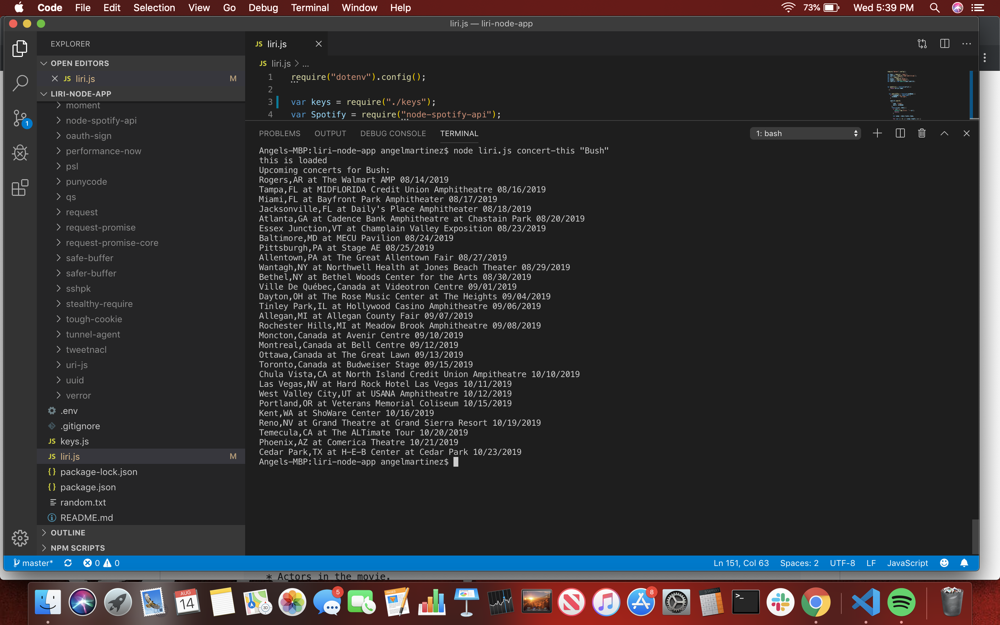

# liri-node-app

This app called liri, is a Language Interpretation and Recognization Interface. LIRI is similar to Iphone's SIRI, an Speech Interpretation and Recognization Interface. LIRI is a command line node app that takes in parameters and gives you back data. 

## Instructions

1. Clone Repo.
2. Open liri-node-app folder.
3. Create a keys.js file inside of the cloned folder.
4. Get Spotify keys from https://developer.spotify.com/my-applications/#!/ to use for the Spotify API and save them inside of the keys.js file.
5. Open the liri.js file and run node through terminal.
6. Use this coomands to make th app work:

node liri.js concert-this "artist/band name here"
node liri.js spotify-this-song "song name here"
node liri.js movie-this "movie name here"
node liri.js do-what-it-says

### Prerequisites

To retrieve the data that will power this app, you'll need to send requests using the axios package to the Bands in Town, Spotify and OMDB APIs.

1. Node-Spotify-API
2. Axios
3. You'll use Axios to grab data from the OMDB API and the Bands In Town API
Moment
4. DotEnv

## Deployment

Node.js

## Authors

* **Angel Martinez** - [angelu9](https://github.com/angelu9)

## Acknowledgments

* UCF Coding Bootcamp
* YouTube
* W3schools.com

## Images

